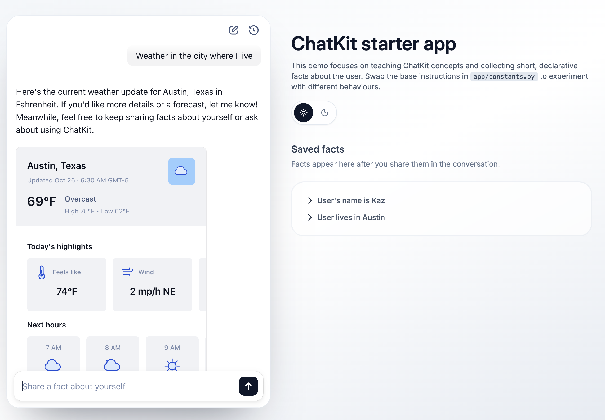
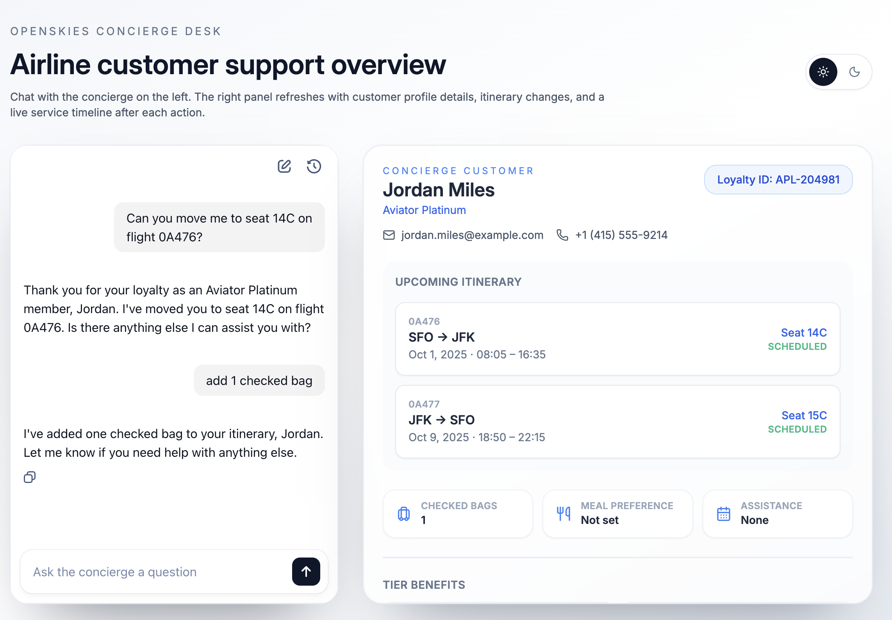
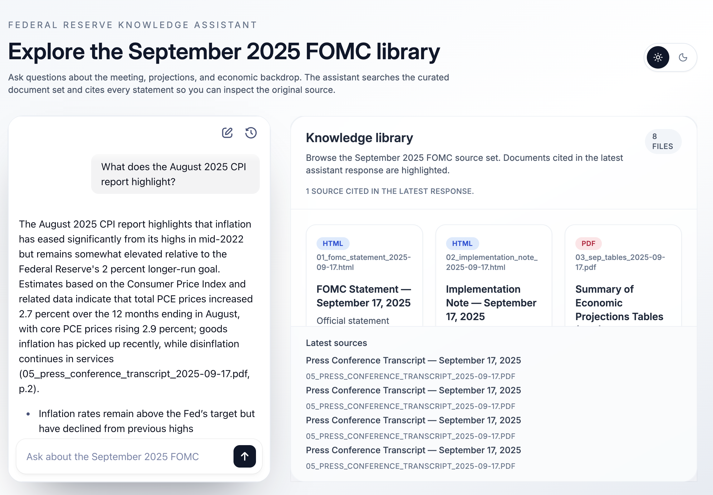

# OpenAI chatkit support for Google ADK

This repository provides the backend support for `openai/chatkit-js` (https://github.com/openai/chatkit-js) for Google ADK based agentic applications.

It uses and extends `openai/chatkit-python` (https://github.com/openai/chatkit-python) by providing

- `ADKStore` that wraps `BaseSessionService`
- A function (`stream_agent_response`) that translate ADK events into chatkit events
- Provides support to render `widgets`
    * See examples/backend/src/backend/agents/facts/_tools.py::get_weather
    * Use `add_widget_to_tool_response` in your tool and `widget` will be sent to client
- Provides support for making calls to client tools.
    * Client tools typically run in browser
    * See examples/backend/src/backend/agents/facts/_tools.py::switch_theme
    * Use `add_client_tool_call_to_tool_response` in you tool

TODO:
- Support for attachments / artifacts

## Install

```bash
uv add adk-chatkit
```

## Running examples

Make sure you open this repository in vscode `devcontainer` and all dependencies will be setup for you

```bash
# At the root of the repository
# fill in your configuration / settings
cp .env.example .env
```

There is one backend and one frontend that hosts 3 agents (chatkit servers) and their corresponding user interface.

```bash
# Run the backend
uv run poe run-example-backend
```

```bash
# Run the frontend
uv run poe run-example-frontend
```

## Usage

See `examples` for full usage

```python

from adk_chatkit import ADKContext, ADKStore, stream_agent_response

class FactsChatkitServer(ChatKitServer[ADKContext]):
    def __init__(
        self,
        store: ADKStore,
        runner_manager: RunnerManager,
        settings: Settings,
    ) -> None:
        super().__init__(store)
        agent = _make_facts_agent(settings)
        self._runner = runner_manager.add_runner(settings.FACTS_APP_NAME, agent)

    async def respond(
        self,
        thread: ThreadMetadata,
        item: UserMessageItem | None,
        context: ADKContext,
    ) -> AsyncIterator[ThreadStreamEvent]:
        if item is None:
            return

        if _is_tool_completion_item(item):
            return

        message_text = _user_message_text(item)
        if not message_text:
            return

        content = genai_types.Content(
            role="user",
            parts=[genai_types.Part.from_text(text=message_text)],
        )

        event_stream = self._runner.run_async(
            user_id=context["user_id"],
            session_id=thread.id,
            new_message=content,
            run_config=RunConfig(streaming_mode=StreamingMode.SSE),
        )

        async for event in stream_agent_response(thread, event_stream):
            yield event

```

## Examples applications

There are 3 applications (ported from https://github.com/openai/openai-chatkit-advanced-samples)

### Facts & Guide

- Shows Fact Recording
- Displays Weather using Widget
- Theme Switching

http://localhost:5173/guide



### Customer Support

- Airline Reservation Management
- Change Seat
- Add bags

http://localhost:5171/customer-support




### Knowledge Assistant

- Answers questions based on files and vector store
- Shows files and citations

http://localhost:5171/knowledge


